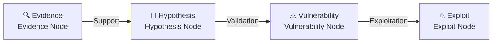
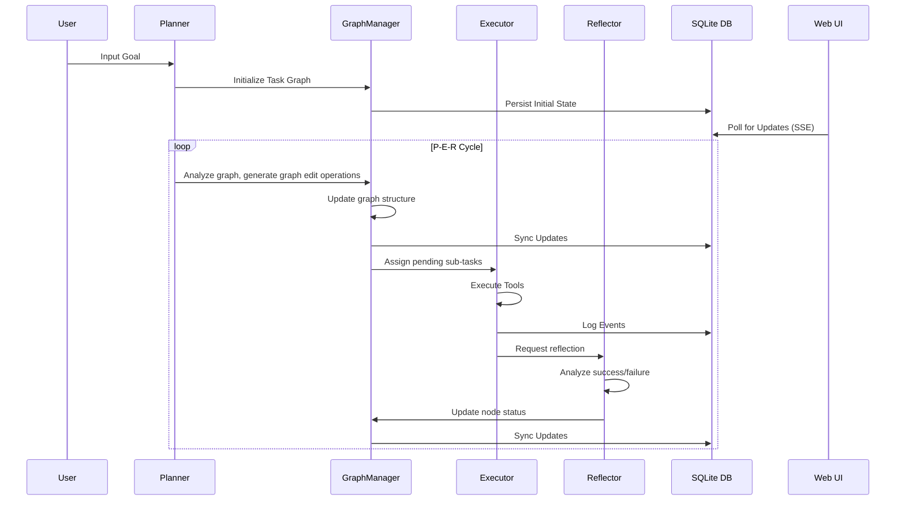

<p align="center">
  
</p>

<h1 align="center">LuaN1aoAgent</h1>

<h2 align="center">

**Cognitive-Driven AI Hackers**

</h2>

<div align="center">

[](https://opensource.org/licenses/Apache-2.0)
[](https://www.python.org/downloads/)
[](CONTRIBUTING.md)
[](#system-architecture)
[](#)
</div>
<div align="center">
<a href="https://zc.tencent.com/competition/competitionHackathon?code=cha004"></a>

---

**🧠 Think Like Human Experts** • **📊 Dynamic Graph Planning** • **🔄 Learn From Failures** • **🎯 Evidence-Driven Decisions**

[🚀 Quick Start](#quick-start) • [✨ Core Innovations](#core-innovations) • [🏗️ System Architecture](#system-architecture) • [🗓️ Roadmap](#roadmap)

[🌐 中文版](README_zh.md) • [English Version](README.md)

</div>

---

## 📖 Introduction

**LuaN1ao (鸾鸟)** is a next-generation **Autonomous Penetration Testing Agent** powered by Large Language Models (LLMs).

Traditional automated scanning tools rely on predefined rules and struggle with complex real-world scenarios. LuaN1ao breaks through these limitations by innovatively integrating the **P-E-R (Planner-Executor-Reflector) Agent Collaboration Framework** with **Causal Graph Reasoning** technology.

LuaN1ao simulates the thinking patterns of human security experts:

- 🎯 **Strategic Planning**: Dynamically plan attack paths based on global situational awareness
- 🔍 **Evidence-Driven**: Build rigorous "Evidence-Hypothesis-Validation" logical chains
- 🔄 **Continuous Evolution**: Learn from failures and autonomously adjust tactical strategies
- 🧠 **Cognitive Loop**: Form a complete cognitive cycle of planning-execution-reflection

From information gathering to vulnerability exploitation, LuaN1ao elevates penetration testing from "automated tools" to an "autonomous agent".

> [!NOTE]
> [LuaN1aoAgent achieves a 90.4% success rate on benchmark tasks fully autonomously, with a median exploit cost of only $0.09.  →](./xbow-benchmark-results)

<p align="center">
  <a href="https://github.com/SanMuzZzZz/LuaN1aoAgent">
      
  </a>
</p>

---

## 🖼️ Showcase

<https://github.com/user-attachments/assets/e2c19442-20db-40ab-a5c6-3bf5c9054ae8>

> 💡 _More demos coming soon!_

---

## 🚀 Core Innovations

### 1️⃣ **P-E-R Agent Collaboration Framework** ⭐⭐⭐

LuaN1ao decouples penetration testing thinking into three independent yet collaborative cognitive roles, forming a complete decision-making loop:

- **🧠 Planner**
  - **Strategic Brain**: Dynamic planning based on global graph awareness
  - **Adaptive Capability**: Identify dead ends and automatically generate alternative paths
  - **Graph Operation Driven**: Output structured graph editing instructions rather than natural language
  - **Parallel Scheduling**: Automatically identify parallelizable tasks based on topological dependencies
  - **Adaptive Step Count**: Allocate extra execution steps (`max_steps`) per subtask for complex tasks (blind injection extraction, multi-stage bypass, etc.)

- **⚙️ Executor**
  - **Tactical Execution**: Focus on single sub-task tool invocation and result analysis
  - **Tool Orchestration**: Unified scheduling of security tools via MCP (Model Context Protocol)
  - **Context Compression**: Intelligent message history management to avoid token overflow
  - **Fault Tolerance**: Automatic handling of network transient errors and tool invocation failures
  - **Hypothesis Persistence**: Hypotheses from `formulate_hypotheses` are preserved across steps and survive context compression
  - **Parallel Discovery Sharing**: Parallel subtasks exchange high-value findings in real-time via a shared bulletin board (ConfirmedVulnerability and high-confidence KeyFact)
  - **First-Step Guidance**: When no confirmed vulnerabilities exist, automatically prompts the agent to formulate a hypothesis framework before blind exploration

- **⚖️ Reflector**
  - **Audit Analysis**: Review task execution and validate artifact effectiveness
  - **Failure Attribution**: L1-L4 level failure pattern analysis to prevent repeated errors
  - **Intelligence Generation**: Extract attack intelligence and build knowledge accumulation
  - **Termination Control**: Judge goal achievement or task entrapment

**Key Advantages**: Role separation avoids the "split personality" problem of single agents. Each component focuses on its core responsibilities and collaborates via event bus.

### 2️⃣ **Causal Graph Reasoning** ⭐⭐⭐

LuaN1ao rejects blind guessing and LLM hallucinations, constructing explicit causal graphs to drive testing decisions:



**Core Principles**:

- **Evidence First**: Any hypothesis requires explicit prior evidence support
- **Confidence Quantification**: Each causal edge has a confidence score to avoid blind advancement
- **Traceability**: Complete recording of reasoning chains for failure tracing and experience reuse
- **Hallucination Prevention**: Mandatory evidence validation, rejecting unfounded attacks

**Example Scenario**:

```
Evidence: Port scan discovers 3306/tcp open
  ↓ (Confidence 0.8)
Hypothesis: Target runs MySQL service
  ↓ (Validation successful)
Vulnerability: MySQL weak password/unauthorized access
  ↓ (Attempt exploitation)
Exploit: mysql -h target -u root -p [brute-force/empty password]
```

### 3️⃣ **Plan-on-Graph (PoG) Dynamic Task Planning** ⭐⭐⭐

Say goodbye to static task lists. LuaN1ao models penetration testing plans as dynamically evolving **Directed Acyclic Graphs (DAGs)**:

**Core Features**:

- **Graph Operation Language**: Planner outputs standardized graph editing operations (`ADD_NODE`, `UPDATE_NODE`, `DEPRECATE_NODE`)
- **Real-time Adaptation**: Task graphs deform in real-time with testing progress
  - Discover new ports → Automatically mount service scanning subgraphs
  - Encounter WAF → Insert bypass strategy nodes
  - Path blocked → Automatically prune or branch planning
- **Topological Dependency Management**: Automatically identify and **parallelize** independent tasks based on DAG topology
- **State Tracking**: Each node contains a state machine (`pending`, `in_progress`, `completed`, `failed`, `deprecated`)

**Comparison with Traditional Planning**:

| Feature | Traditional Task List | Plan-on-Graph |
|---------|----------------------|---------------|
| Structure | Linear list | Directed graph |
| Dependency Management | Manual sorting | Topological auto-sorting |
| Parallel Capability | None | Auto-identify parallel paths |
| Dynamic Adjustment | Regenerate | Local graph editing |
| Visualization | Difficult | Native support (Web UI) |

**Visualization Example**: Start the Web Server to view the task graph evolution in real-time in the browser.

---

## Core Capabilities

### Tool Integration (MCP Protocol)

LuaN1ao achieves unified integration and scheduling of tools through the **Model Context Protocol (MCP)**:

- **HTTP/HTTPS Requests**: Support for custom headers, proxies, timeout control
- **Shell Command Execution**: Securely encapsulated system command invocation (containerized execution recommended)
- **Python Code Execution**: Dynamic execution of Python scripts for complex logic processing
- **Metacognitive Tools**: `think` (deep thinking), `formulate_hypotheses` (hypothesis generation), `reflect_on_failure` (failure reflection)
- **Task Control**: `halt_task` (early task termination)
- **Local Graph Query**: `query_causal_graph` (direct in-process causal graph lookup, zero MCP latency)

> 💡 **Extensibility**: New tools can be easily integrated via `mcp.json` (e.g., Metasploit, Nuclei, Burp Suite API)

### Knowledge Enhancement (RAG)

- **Vector Retrieval**: Efficient knowledge base retrieval based on FAISS
- **Domain Knowledge**: Integration of PayloadsAllTheThings and other open-source security knowledge bases
- **Dynamic Learning**: Continuous addition of custom knowledge documents

### Web Visualization (New Architecture)

The Web UI is now a standalone service powered by a database, enabling persistent task monitoring and management.

- **Real-time Monitoring**: Browser view of dynamic task graph evolution and live logs.
- **Node Details**: Click nodes to view execution logs, artifacts, state transitions.
- **Task Management**: Create, abort, and **delete** historical tasks.
- **Data Persistence**: All task data is stored in SQLite (`luan1ao.db`), preserving history across restarts.

### Human-in-the-Loop (HITL) Mode

LuaN1ao Agent supports a Human-in-the-Loop (HITL) mode, allowing experts to supervise and intervene in the decision-making process.

- **Enable**: Set `HUMAN_IN_THE_LOOP=true` in `.env`.
- **Approval**: The agent pauses after generating a plan (initial or dynamic), waiting for human approval via Web UI or CLI.
- **Modification**: Experts can reject or directly modify the plan (JSON editing) before execution.
- **Injection**: Supports real-time injection of new sub-tasks via the Web UI ("Active Intervention").

**Interaction Methods**:

- **Web UI**: Approval modal pops up automatically. Use "Modify" to edit plans or "Add Task" button to inject tasks.
- **CLI**: Prompts with `HITL >`. Type `y` to approve, `n` to reject, or `m` to modify (opens system editor).

---

## <a id="roadmap"></a>🗓️ Roadmap

- [ ] **Experience Self-Evolution**
  - Cross-task long-term memory
  - Automatic extraction of successful attack patterns into vector library
  - Intelligent recommendations based on historical experience

- [x] **Human-in-the-Loop Mode**
  - Pre-high-risk operation confirmation mechanism
  - Runtime task graph editing interface (Graph Injection)
  - Expert intervention and strategy injection

- [ ] **Tool Ecosystem Expansion**
  - Integration of Metasploit RPC interface
  - Support for Nuclei, Xray, AWVS scanners
  - Docker sandboxed tool execution environment

- [ ] **Multimodal Capabilities**
  - Image recognition (CAPTCHA, screenshot analysis)
  - Traffic analysis (PCAP file parsing)

### Long-term Vision

- [ ] **Collaborative Agent Network**: Multi-agent distributed collaboration
- [ ] **Reinforcement Learning Integration**: Autonomous optimization of attack strategies through environmental interaction, achieving self-evolution and strategy convergence of agents in complex scenarios
- [ ] **Compliance Report Generation**: Automatic generation of compliant penetration testing reports

---

## 📋 System Requirements

| Component | Requirements | Notes |
|-----------|--------------|-------|
| **Operating System** | Linux (recommended) / macOS / Windows (WSL2) | Recommended to run in isolated environments |
| **Python** | 3.10+ | Requires support for asyncio and type hints |
| **LLM API** | OpenAI compatible format | Supports GPT-4o, DeepSeek, Claude-3.5, etc. |
| **Memory** | Minimum 4GB, recommended 8GB+ | RAG services and LLM inference require memory |
| **Network** | Internet connection | Access to LLM APIs and knowledge base updates |

> ⚠️ **Security Notice**: LuaN1ao includes high-privilege tools like `shell_exec` and `python_exec`. **Strongly recommend running in Docker containers or virtual machines** to avoid potential risks to the host system.

---

## 🚀 Quick Start

### Step 1: Installation

```bash
# Clone repository
git clone https://github.com/SanMuzZzZz/LuaN1aoAgent.git
cd LuaN1aoAgent

# Create virtual environment (recommended)
python3 -m venv venv
source venv/bin/activate  # Linux/macOS
# Windows: venv\Scripts\activate

# Install dependencies
pip install -r requirements.txt
```

### Step 2: Configuration

#### 2.1 Environment Variables Configuration

```bash
# Copy configuration template
cp .env.example .env

# Edit .env file
nano .env  # or use your preferred editor
```

**Core Configuration Items**:

```ini
# LLM API Configuration (required)
LLM_API_KEY=sk-xxxxxxxxxxxxxxxxxxxxxxxx
LLM_API_BASE_URL=https://api.openai.com/v1

# Recommended to use powerful models for better results
LLM_DEFAULT_MODEL=gpt-4o
LLM_PLANNER_MODEL=gpt-4o    # Planner requires strong reasoning capability
LLM_EXECUTOR_MODEL=gpt-4o
LLM_REFLECTOR_MODEL=gpt-4o

OUTPUT_MODE=default    # simple/default/debug
```

#### 2.2 Knowledge Base Initialization (Required for First Run)

LuaN1ao relies on the **RAG (Retrieval-Augmented Generation)** system to obtain the latest security knowledge. The knowledge base needs to be initialized before the first run:

```bash
# 1. Clone PayloadsAllTheThings knowledge base
mkdir -p knowledge_base
git clone https://github.com/swisskyrepo/PayloadsAllTheThings \
    knowledge_base/PayloadsAllTheThings

# 2. Build vector index (takes a few minutes)
cd rag
python -m rag_kdprepare
```

> **Knowledge Base Description**: PayloadsAllTheThings contains rich attack payloads, bypass techniques, and vulnerability exploitation methods, making it a valuable resource for penetration testing.

### Step 3: Running (New Architecture)

The system now runs as two separate processes: the **Web Server** (dashboard) and the **Agent** (worker). They communicate via a local SQLite database (`luan1ao.db`).

#### 1. Start the Web Server (Dashboard)

Start the persistent web interface first. This process should remain running.

```bash
python -m web.server
```

> Open your browser and visit: **<http://localhost:8088>**

#### 2. Run an Agent Task

Open a **new terminal window** and run the agent. The agent will execute the task, write logs to the database, and exit when finished. The Web UI will update in real-time.

```bash
# Basic usage
python agent.py \
    --goal "Perform comprehensive web security testing on http://testphp.vulnweb.com" \
    --task-name "demo_test"

# Enable --web flag to print the task URL
python agent.py \
    --goal "Scan localhost" \
    --task-name "local_scan" \
    --web
```

### Viewing Results

- **Real-time**: Use the Web UI (<http://localhost:8088>) to monitor progress.
- **Archives**: Task history is persisted in the database. Logs and metrics are also saved in `logs/TASK-NAME/TIMESTAMP/`:

```
logs/demo_test/20250204_120000/
├── run_log.json          # Complete execution log (includes all P-E-R interactions)
├── metrics.json          # Performance metrics and statistics
└── console_output.log    # Formatted console output
```

---

## <a id="system-architecture"></a>🏗️ System Architecture

### Overall Architecture Diagram

```
┌─────────────────────────────────────────────────────────┐
│                  User Goal                              │
│            "Perform comprehensive penetration testing"   │
└────────────────────────┬────────────────────────────────┘
                         ▼
┌─────────────────────────────────────────────────────────┐
│              P-E-R Cognitive Layer                      │
│  ┌──────────┐      ┌──────────┐      ┌──────────┐      │
│  │ Planner  │ ───> │ Executor │ ───> │Reflector │      │
│  │          │      │          │      │          │      │
│  └──────────┘      └──────────┘      └──────────┘      │
│       │                  │                  │            │
│       └──────────────────┴──────────────────┘            │
│                         ▲                                │
│                         │  LLM API Calls                  │
└─────────────────────────┼────────────────────────────────┘
                          │
┌─────────────────────────┴────────────────────────────────┐
│               Core Engine                               │
│  ┌────────────────────────────────────────────────┐     │
│  │ GraphManager                                   │     │
│  │ • Task Graph Management (DAG)                  │     │
│  │ • State Tracking and Updates                   │     │
│  │ • Topological Sorting and Dependency Resolution│     │
│  │ • Parallel Task Scheduling                     │     │
│  │ • Shared Bulletin Board (shared_findings)      │     │
│  │ • Causal Graph Tiered Storage                  │     │
│  └────────────────────────────────────────────────┘     │
│  ┌────────────────────────────────────────────────┐     │
│  │ Database Layer (SQLite)                        │     │
│  │ • Persistence for Tasks, Graphs, Logs          │     │
│  │ • Decoupled State Management                   │     │
│  └────────────────────────────────────────────────┘     │
│  ┌────────────────────────────────────────────────┐     │
│  │ EventBroker (Global)                           │     │
│  │ • Inter-component Communication                │     │
│  │ • Event Publishing/Subscription                │     │
│  └────────────────────────────────────────────────┘     │
└─────────────────────────┬────────────────────────────────┘
                          │
┌─────────────────────────┴────────────────────────────────┐
│            Capability Layer                            │
│  ┌────────────────────┐  ┌──────────────────────────┐   │
│  │ RAG Knowledge      │  │ MCP Tool Server          │   │
│  │ Service            │  │                          │   │
│  │ • FAISS Vector Retrieval│ • http_request           │   │
│  │ • Knowledge Document Parsing│ • shell_exec             │   │
│  │ • Similarity Search │ • python_exec            │   │
│  │                    │  • think/formulate_hyp.  │   │
│  └────────────────────┘  │ • halt_task              │   │
│                          │ • query_causal_graph(local)│ │
│                          └──────────────────────────┘   │
└──────────────────────────────────────────────────────────┘
```

### P-E-R Collaboration Flow



### Directory Structure

```
LuaN1aoAgent/
├── agent.py                    # Main entry point, P-E-R cycle control
├── requirements.txt            # Project dependencies
├── pyproject.toml             # Project configuration and code quality tool settings
├── mcp.json                   # MCP tool service configuration
├── .env                       # Environment variables configuration (manual creation required)
│
├── conf/                      # Configuration module
│   ├── config.py             # Core configuration items (LLM, scenarios, parameters)
│   └── __init__.py
│
├── core/                      # Core engine
│   ├── planner.py            # Planner implementation
│   ├── executor.py           # Executor implementation
│   ├── reflector.py          # Reflector implementation
│   ├── graph_manager.py      # Graph manager
│   ├── events.py             # Event bus
│   ├── console.py            # Console output management
│   ├── data_contracts.py     # Data contract definitions
│   ├── tool_manager.py       # Tool manager
│   ├── intervention.py       # Human-in-the-Loop manager
│   ├── database/             # Database persistence layer
│   │   ├── models.py         # SQLAlchemy models
│   │   └── utils.py          # DB utilities
│   └── prompts/              # Prompt template system
│
├── llm/                       # LLM abstraction layer
│   ├── llm_client.py         # LLM client (unified interface)
│   └── __init__.py
│
├── rag/                       # RAG knowledge enhancement
│   ├── knowledge_service.py  # FastAPI knowledge service
│   ├── rag_client.py         # RAG client
│   ├── rag_kdprepare.py      # Knowledge base index construction
│   ├── markdown_chunker.py   # Document chunking
│   └── model_manager.py      # Embedding model management
│
├── tools/                     # Tool integration layer
│   ├── mcp_service.py        # MCP service implementation
│   ├── mcp_client.py         # MCP client
│   └── __init__.py
│
├── web/                       # Web UI
│   ├── server.py             # Web dashboard server
│   ├── static/               # Frontend assets
│   └── templates/            # HTML templates
│
├── knowledge_base/            # Knowledge base directory (manual creation required)
│   └── PayloadsAllTheThings/ # Security knowledge base (clone required)
│
└── logs/                      # Runtime logs and metrics
    └── TASK-NAME/
        └── TIMESTAMP/
            ├── run_log.json
            ├── metrics.json
            └── console_output.log
```

---

## 🔐 Security Disclaimer

**⚠️ IMPORTANT: This software is intended for authorized security testing and educational purposes only.**

By downloading, installing, or using LuaN1ao, you expressly acknowledge and agree to the following:

- **Strictly Authorized Use**: You must obtain explicit written consent from system owners before testing. Unauthorized access is illegal and prohibited.
- **No Warranties**: This software is provided "AS IS", without warranty of any kind.
- **Assumption of Risk**: The tool contains high-privilege execution capabilities (`shell_exec`, `python_exec`). Running it in an isolated environment (like Docker or a VM) is strongly recommended. Do not use it in production environments.
- **Limitation of Liability**: The developers and contributors are not responsible for any damage, data loss, or legal consequences resulting from the use or misuse of this tool. You assume full responsibility for your actions.

**If you do not agree to these terms, do not use this software.**

## 👥 Contributors

[](https://github.com/SanMuzZzZz/LuaN1aoAgent/graphs/contributors)

---

## 🤝 Contribution

We welcome all forms of contributions! Whether reporting bugs, suggesting new features, improving documentation, or submitting code.

### How to Contribute

1. **Report Issues**: Submit bug reports or feature requests on the [Issues](https://github.com/SanMuzZzZz/LuaN1aoAgent/issues) page
2. **Submit Code**: Fork the repository, create a branch, and submit a Pull Request
3. **Improve Documentation**: Correct errors, supplement explanations, add examples
4. **Share Experience**: Share usage experiences and best practices in Discussions

### Contribution Guidelines

For detailed contribution processes and code standards, please refer to [CONTRIBUTING.md](CONTRIBUTING.md).

---

## 📝 License

This project is licensed under the [Apache License 2.0](LICENSE).

```
Copyright 2025 LuaN1ao (鸾鸟) Project Contributors

Licensed under the Apache License, Version 2.0 (the "License");
you may not use this file except in compliance with the License.
You may obtain a copy of the License at

    http://www.apache.org/licenses/LICENSE-2.0

Unless required by applicable law or agreed to in writing, software
distributed under the License is distributed on an "AS IS" BASIS,
WITHOUT WARRANTIES OR CONDITIONS OF ANY KIND, either express or implied.
See the License for the specific language governing permissions and
limitations under the License.
```

---

## 📞 Contact Us

- **GitHub Issues**: [Submit Issues](https://github.com/SanMuzZzZz/LuaN1aoAgent/issues)
- **GitHub Discussions**: [Join Discussions](https://github.com/SanMuzZzZz/LuaN1aoAgent/discussions)
- **Email**: <1614858685x@gmail.com>
- **WeChat**: SanMuzZzZzZz

---

## ⭐ Star History

If LuaN1ao has been helpful to you, please give us a Star ⭐!

[](https://www.star-history.com/?repos=SanMuzZzZz%2FLuaN1aoAgent&type=date&legend=top-left)

---

## 🌐 Language Versions

- [English](README.md) (Default)
- [简体中文](README_zh.md)
