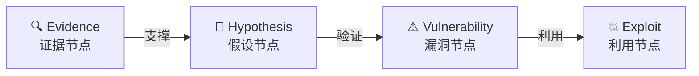
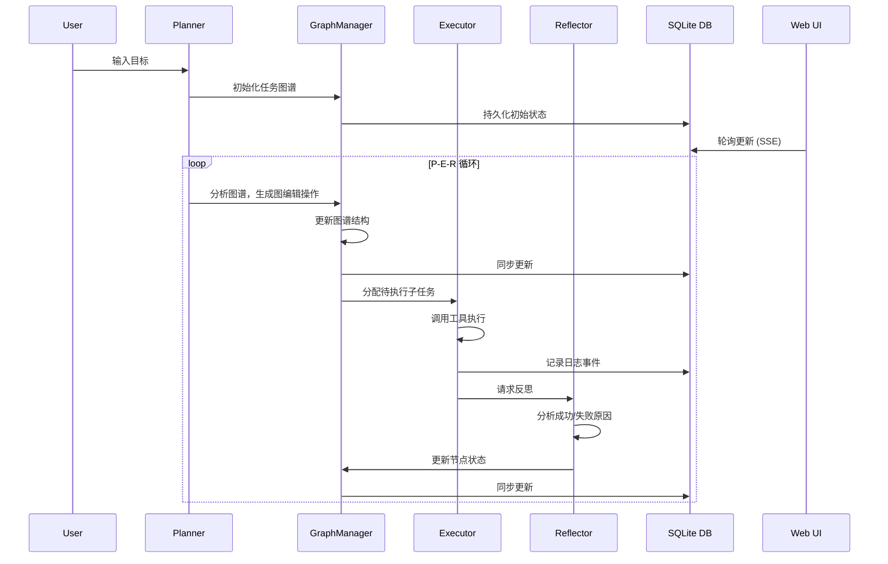

<p align="center">
  
</p>

<h1 align="center">鸾鸟Agent</h1>

<h2 align="center">

**认知驱动的 AI 黑客**

</h2>

<div align="center">

[](https://opensource.org/licenses/Apache-2.0)
[](https://www.python.org/downloads/)
[](CONTRIBUTING.md)
[](#-系统架构)
[](#)
</div>
<div align="center">
<a href="https://zc.tencent.com/competition/competitionHackathon?code=cha004"></a>

---

**🧠 像人类专家一样思考** • **📊 动态图谱规划** • **🔄 从失败中学习** • **🎯 证据驱动决策**

[🚀 快速开始](#-快速开始) • [✨ 核心创新](#-核心创新) • [🏗️ 系统架构](#-系统架构) • [🗓️ 路线图](#-roadmap-规划路线)

[🌐 中文版](README_zh.md) • [English Version](README.md)

</div>

---

## 📖 简介

**鸾鸟 (LuaN1ao)** 是新一代**基于大模型的自主渗透测试智能体**。

传统自动化扫描工具依赖预定义规则，难以应对复杂多变的实战场景。鸾鸟突破这一局限，创新性地融合了 **P-E-R (Planner-Executor-Reflector) 智能体协同框架**与**因果图谱推理 (Causal Graph Reasoning)** 技术。

鸾鸟模拟人类安全专家的思维方式：

- 🎯 **战略规划**：基于全局态势动态规划攻击路径
- 🔍 **证据驱动**：构建严密的"证据-假设-验证"逻辑链
- 🔄 **持续进化**：从失败中学习，自主调整战术策略
- 🧠 **认知闭环**：规划-执行-反思，形成完整的认知循环

从信息收集到漏洞利用，鸾鸟将渗透测试从"自动化工具"提升为"自主智能体"。

> [!NOTE]
> [LuaN1aoAgent 在基准测试任务中实现了 90.4% 的全自主成功率，中位漏洞利用成本仅为 $0.09。 →](./xbow-benchmark-results)
>

<p align="center">
  <a href="https://github.com/SanMuzZzZz/LuaN1aoAgent">
      
  </a>
</p>

---

## 🖼️ 展示

<https://github.com/user-attachments/assets/f717f725-f4a6-4508-8806-c5a66027aae5>

> 💡 _更多演示内容即将推出！_

---

## 🚀 核心创新

### 1️⃣ **P-E-R 智能体协同框架** ⭐⭐⭐

鸾鸟将渗透测试思维解耦为三个独立且协作的认知角色，形成完整的决策闭环：

- **🧠 Planner (规划器)**
  - **战略层大脑**：基于全局图谱进行动态规划
  - **自适应能力**：识别死胡同，自动生成备选路径
  - **图操作驱动**：输出结构化的图编辑指令而非自然语言
  - **并行调度**：基于拓扑依赖自动识别可并行执行的任务

- **🧠 Planner (规划器)**
  - **战略层大脑**：基于全局图谱进行动态规划
  - **自适应能力**：识别死胡同，自动生成备选路径
  - **图操作驱动**：输出结构化的图编辑指令而非自然语言
  - **并行调度**：基于拓扑依赖自动识别可并行执行的任务
  - **自适应步数**：为复杂子任务（盲注提取、多阶段绕过等）单独分配更多执行步数

- **⚙️ Executor (执行器)**
  - **战术层执行**：专注于单一子任务的工具调用和结果分析
  - **工具编排**：通过 MCP (Model Context Protocol) 统一调度安全工具
  - **上下文压缩**：智能管理消息历史，避免 token 溢出
  - **容错重试**：自动处理网络瞬时错误和工具调用失败
  - **假设持久化**：`formulate_hypotheses` 生成的假设跨步骤保留，不因上下文压缩丢失
  - **并行发现共享**：并行执行的子任务通过共享公告板实时交换高价值发现（ConfirmedVulnerability 及高置信 KeyFact）
  - **首步引导**：无已知漏洞时，自动提示先制定假设框架，减少盲目试探

- **⚖️ Reflector (反思器)**
  - **审计分析**：复盘任务执行，验证产出物有效性
  - **失败归因**：L1-L4 级失败模式分析，防止重复错误
  - **情报生成**：提取攻击情报，构建知识积累
  - **终止控制**：判断目标达成或任务陷入困境

**关键优势**：角色分离避免了单一 Agent 的"精神分裂"问题，每个组件专注于其核心职责，通过事件总线协作。

### 2️⃣ **因果图谱推理 (Causal Graph Reasoning)** ⭐⭐⭐

鸾鸟拒绝盲目猜测和大模型幻觉，构建显式的因果图谱来驱动测试决策：



**核心原则**：

- **证据必须先行**：任何假设都需要明确的前置证据支撑
- **置信度量化**：每个因果边都有置信度评分，避免盲目推进
- **可追溯性**：完整记录推理链条，支持失败溯源和经验复用
- **防止幻觉**：强制要求证据验证，拒绝无根据的攻击尝试

**示例场景**：

```
Evidence: 端口扫描发现 3306/tcp 开放
  ↓ (置信度 0.8)
Hypothesis: 目标运行 MySQL 服务
  ↓ (验证成功)
Vulnerability: MySQL 弱口令/未授权访问
  ↓ (尝试利用)
Exploit: mysql -h target -u root -p [爆破/空密码]
```

### 3️⃣ **Plan-on-Graph (PoG) 基于图的动态任务规划** ⭐⭐⭐

告别静态任务清单，鸾鸟将渗透测试计划建模为动态演进的**有向无环图 (DAG)**：

**核心特性**：

- **图操作语言**：Planner 输出标准化的图编辑操作 (`ADD_NODE`, `UPDATE_NODE`, `DEPRECATE_NODE`)
- **实时自适应**：任务图随测试进度实时变形
  - 发现新端口 → 自动挂载服务扫描子图
  - 遇到 WAF → 插入绕过策略节点
  - 路径不通 → 自动修剪或分支规划
- **拓扑依赖管理**：基于 DAG 拓扑自动识别并**并行执行**无依赖任务
- **状态追踪**：每个节点包含状态机 (`pending`, `in_progress`, `completed`, `failed`, `deprecated`)

**与传统规划的对比**：

| 特性 | 传统 Task List | Plan-on-Graph |
|------|----------------|---------------|
| 结构 | 线性列表 | 有向图谱 |
| 依赖管理 | 手动排序 | 拓扑自动排序 |
| 并行能力 | 无 | 自动识别并行路径 |
| 动态调整 | 重新生成 | 局部图编辑 |
| 可视化 | 困难 | 原生支持 (Web UI) |

**可视化示例**：启动 `--web` 模式后，可在浏览器实时查看任务图的演化过程。

---

## 核心能力

### 工具集成 (MCP Protocol)

鸾鸟通过 **Model Context Protocol (MCP)** 实现工具的统一集成和调度：

- **HTTP/HTTPS 请求**：支持自定义 Headers、代理、超时控制
- **Shell 命令执行**：安全封装的系统命令调用（建议容器化运行）
- **Python 代码执行**：动态执行 Python 脚本用于复杂逻辑处理
- **元认知工具**：`think`（深度思考）、`formulate_hypotheses`（假设生成）、`reflect_on_failure`（失败反思）
- **任务控制**：`halt_task`（提前终止任务）
- **本地图谱查询**：`query_causal_graph`（直接查询因果图节点，无 MCP 延迟）

> 💡 **扩展性**：可通过 `mcp.json` 轻松集成新工具（如 Metasploit、Nuclei、Burp Suite API）

### 知识增强 (RAG)

- **向量检索**：基于 FAISS 的高效知识库检索
- **领域知识**：集成 PayloadsAllTheThings 等开源安全知识库
- **动态学习**：可持续添加自定义知识文档

### Web 可视化 (新架构)

Web UI 现在是一个独立的数据库驱动的服务，支持持久化的任务监控和管理。

- **实时监控**：在浏览器中查看动态任务图的演化和实时日志。
- **节点详情**：点击节点查看详细的执行日志、产出物和状态转换。
- **任务管理**：支持创建、终止和**删除**历史任务。
- **数据持久化**：所有任务数据存储在 SQLite (`luan1ao.db`) 中，重启后历史记录不丢失。

### 人机协同 (HITL) 模式

鸾鸟智能体支持人机协同（Human-in-the-Loop, HITL）模式，允许人类专家监督和干预智能体的决策过程。这增强了控制力、安全性，并能在复杂场景中提供专家指导。

- **启用**: 在 `.env` 中设置 `HUMAN_IN_THE_LOOP=true`。
- **审批**: 智能体在生成计划（初始或动态）后暂停，等待人类通过 Web UI 或 CLI 进行审批。
- **修改**: 专家可以拒绝或直接修改计划（JSON 编辑）后再执行。
- **注入**: 支持通过 Web UI 实时注入新的子任务（“主动干预”）。

**交互方式**:

- **Web UI**: 审批模态框自动弹出。使用“修改”按钮编辑计划，或使用“加任务”按钮注入任务。
- **CLI**: 提示符为 `HITL >`。输入 `y` 批准，`n` 拒绝，`m` 修改（会打开系统编辑器）。

---

## <a id="roadmap"></a>🗓️ Roadmap 规划路线

- [ ] **经验自进化 (Experience Self-Evolution)**
  - 跨任务长期记忆 (Long-term Memory)
  - 自动提取成功攻击模式并存入向量库
  - 基于历史经验的智能推荐

- [x] **人机协同模式 (Human-in-the-Loop)**
  - 高危操作前的人工确认机制
  - 运行时任务图谱编辑界面 (Graph Injection)
  - 专家干预和策略注入

- [ ] **工具生态扩容**
  - 集成 Metasploit RPC 接口
  - 支持 Nuclei、Xray、AWVS 等扫描器
  - Docker 沙箱化工具执行环境

- [ ] **多模态能力**
  - 图像识别（验证码、截图分析）
  - 流量分析（PCAP 文件解析）

### 长期愿景

- [ ] **协作智能体网络**：多 Agent 分布式协作
- [ ] **强化学习集成**：通过与环境交互自主优化攻击策略，实现智能体在复杂场景下的自我进化和策略收敛
- [ ] **合规报告生成**：自动生成符合标准的渗透测试报告

---

## 📋 系统要求

| 组件 | 要求 | 说明 |
|------|------|------|
| **操作系统** | Linux (推荐) / macOS / Windows (WSL2) | 建议在隔离环境中运行 |
| **Python** | 3.10+ | 需要支持 asyncio 和类型提示 |
| **LLM API** | OpenAI 兼容格式 | 支持 GPT-4o, DeepSeek, Claude-3.5 等 |
| **内存** | 最小 4GB，推荐 8GB+ | RAG 服务和 LLM 推理需要内存 |
| **网络** | 互联网连接 | 访问 LLM API 和更新知识库 |

> ⚠️ **安全提示**：鸾鸟包含 `shell_exec` 和 `python_exec` 等高权限工具，**强烈建议在 Docker 容器或虚拟机中运行**，避免对宿主机造成潜在风险。

---

## 🚀 快速开始

### 步骤 1：安装

```bash
# 克隆仓库
git clone https://github.com/SanMuzZzZz/LuaN1aoAgent.git
cd LuaN1aoAgent

# 创建虚拟环境（推荐）
python3 -m venv venv
source venv/bin/activate  # Linux/macOS
# Windows: venv\Scripts\activate

# 安装依赖
pip install -r requirements.txt
```

### 步骤 2：配置

#### 2.1 环境变量配置

```bash
# 复制配置模板
cp .env.example .env

# 编辑 .env 文件
nano .env  # 或使用你喜欢的编辑器
```

**核心配置项**：

```ini
# LLM API 配置（必填）
LLM_API_KEY=sk-xxxxxxxxxxxxxxxxxxxxxxxx
LLM_API_BASE_URL=https://api.openai.com/v1

# 推荐使用强大模型以获得更好效果
LLM_DEFAULT_MODEL=gpt-4o
LLM_PLANNER_MODEL=gpt-4o    # 规划器需要强推理能力
LLM_EXECUTOR_MODEL=gpt-4o
LLM_REFLECTOR_MODEL=gpt-4o

OUTPUT_MODE=default    # simple/default/debug
```

#### 2.2 知识库初始化（首次运行必需）

鸾鸟依赖 **RAG (检索增强生成)** 系统获取最新安全知识。首次运行前需初始化知识库：

```bash
# 1. 克隆 PayloadsAllTheThings 知识库
mkdir -p knowledge_base
git clone https://github.com/swisskyrepo/PayloadsAllTheThings \
    knowledge_base/PayloadsAllTheThings

# 2. 构建向量索引（需要几分钟）
cd rag
python -m rag_kdprepare
```

> **知识库说明**：PayloadsAllTheThings 包含丰富的攻击载荷、绕过技巧和漏洞利用方法，是渗透测试的宝贵资源。

### 步骤 3：运行 (新架构)

系统现在分为两个独立进程运行：**Web 服务**（监控台）和 **Agent**（工作进程）。它们通过本地 SQLite 数据库 (`luan1ao.db`) 通信。

#### 1. 启动 Web 服务 (监控台)

首先启动持久化的 Web 界面。该进程应保持运行。

```bash
python -m web.server
```

> 打开浏览器访问：**<http://localhost:8088>**

#### 2. 运行 Agent 任务

打开一个**新的终端窗口**运行 Agent。Agent 将执行任务，将日志写入数据库，并在完成后退出。Web UI 会实时更新。

```bash
# 基础用法
python agent.py \
    --goal "对 http://testphp.vulnweb.com 进行全面的 Web 安全测试" \
    --task-name "demo_test"

# 启用 --web 标志以打印任务 URL
python agent.py \
    --goal "扫描 localhost" \
    --task-name "local_scan" \
    --web
```

### 查看结果

- **实时查看**：使用 Web UI (<http://localhost:8088>) 监控进度。
- **历史归档**：任务历史持久化存储在数据库中。日志和指标也会保存在 `logs/TASK-NAME/TIMESTAMP/` 目录：

```
logs/demo_test/20250204_120000/
├── run_log.json          # 完整执行日志（包含所有 P-E-R 交互）
├── metrics.json          # 性能指标和统计数据
└── console_output.log    # 格式化的控制台输出
```

---

## <a id="system-architecture"></a>🏗️ 系统架构

### 整体架构图

```
┌─────────────────────────────────────────────────────────┐
│                  用户目标 (User Goal)                    │
│            "对目标系统进行全面的渗透测试"                 │
└────────────────────────┬────────────────────────────────┘
                         ▼
┌─────────────────────────────────────────────────────────┐
│              P-E-R 认知层 (Cognitive Layer)              │
│  ┌──────────┐      ┌──────────┐      ┌──────────┐      │
│  │ Planner  │ ───> │ Executor │ ───> │Reflector │      │
│  │  规划器   │      │  执行器   │      │  反思器   │      │
│  └──────────┘      └──────────┘      └──────────┘      │
│       │                  │                  │            │
│       └──────────────────┴──────────────────┘            │
│                         ▲                                │
│                         │  LLM API 调用                   │
└─────────────────────────┼────────────────────────────────┘
                          │
┌─────────────────────────┴────────────────────────────────┐
│               核心引擎 (Core Engine)                      │
│  ┌────────────────────────────────────────────────┐     │
│  │ GraphManager                                   │     │
│  │ • 任务图谱管理 (DAG)                            │     │
│  │ • 状态追踪与更新                                 │     │
│  │ • 拓扑排序与依赖解析                             │     │
│  │ • 并行任务调度                                   │     │
│  │ • 共享公告板 (shared_findings)                  │     │
│  │ • 因果图谱 (causal_graph) 分级存储              │     │
│  └────────────────────────────────────────────────┘     │
│  ┌────────────────────────────────────────────────┐     │
│  │ 数据库层 (SQLite)                               │     │
│  │ • 任务、图谱、日志的持久化存储                    │     │
│  │ • 状态管理解耦                                   │     │
│  └────────────────────────────────────────────────┘     │
│  ┌────────────────────────────────────────────────┐     │
│  │ EventBroker (全局)                              │     │
│  │ • 组件间通信                                     │     │
│  │ • 事件发布/订阅                                  │     │
│  └────────────────────────────────────────────────┘     │
└─────────────────────────┬────────────────────────────────┘
                          │
┌─────────────────────────┴────────────────────────────────┐
│            能力支撑层 (Capability Layer)                  │
│  ┌────────────────────┐  ┌──────────────────────────┐   │
│  │ RAG Knowledge      │  │ MCP Tool Server          │   │
│  │ Service            │  │                          │   │
│  │ • FAISS 向量检索   │  │ • http_request           │   │
│  │ • 知识文档解析     │  │ • shell_exec             │   │
│  │ • 相似度搜索       │  │ • python_exec            │   │
│  │                    │  │ • think/formulate_hyp.   │   │
│  └────────────────────┘  │ • halt_task              │   │
│                          │ • query_causal_graph(本地)│  │
│                          └──────────────────────────┘   │
└──────────────────────────────────────────────────────────┘
```

### P-E-R 协作流程



### 目录结构

```
LuaN1aoAgent/
├── agent.py                    # 主入口，P-E-R 循环控制
├── requirements.txt            # 项目依赖
├── pyproject.toml             # 项目配置和代码质量工具设置
├── mcp.json                   # MCP 工具服务配置
├── .env                       # 环境变量配置（需手动创建）
│
├── conf/                      # 配置模块
│   ├── config.py             # 核心配置项（LLM、场景、参数）
│   └── __init__.py
│
├── core/                      # 核心引擎
│   ├── planner.py            # 规划器实现
│   ├── executor.py           # 执行器实现
│   ├── reflector.py          # 反思器实现
│   ├── graph_manager.py      # 图谱管理器
│   ├── events.py             # 事件总线
│   ├── console.py            # 控制台输出管理
│   ├── data_contracts.py     # 数据契约定义
│   ├── tool_manager.py       # 工具管理器
│   ├── intervention.py       # 人机协同管理器
│   ├── database/             # 数据库持久化层
│   │   ├── models.py         # SQLAlchemy 模型
│   │   └── utils.py          # 数据库工具函数
│   └── prompts/              # 提示词模板系统
│
├── llm/                       # LLM 抽象层
│   ├── llm_client.py         # LLM 客户端（统一接口）
│   └── __init__.py
│
├── rag/                       # RAG 知识增强
│   ├── knowledge_service.py  # FastAPI 知识服务
│   ├── rag_client.py         # RAG 客户端
│   ├── rag_kdprepare.py      # 知识库索引构建
│   ├── markdown_chunker.py   # 文档分块
│   └── model_manager.py      # 嵌入模型管理
│
├── tools/                     # 工具集成层
│   ├── mcp_service.py        # MCP 服务实现
│   ├── mcp_client.py         # MCP 客户端
│   └── __init__.py
│
├── web/                       # Web UI
│   ├── server.py             # Web 监控台服务
│   ├── static/               # 前端静态资源
│   └── templates/            # HTML 模板
│
├── knowledge_base/            # 知识库目录（需手动创建）
│   └── PayloadsAllTheThings/ # 安全知识库（需克隆）
│
└── logs/                      # 运行日志和指标
    └── TASK-NAME/
        └── TIMESTAMP/
            ├── run_log.json
            ├── metrics.json
            └── console_output.log
```

---

## 🔐 安全免责声明

**⚠️ 重要提示：本软件仅供用于授权的安全测试和教育目的。**

下载、安装或使用鸾鸟 (LuaN1ao) 即表示您明确确认并同意以下内容：

- **严格授权使用：** 在测试之前，您必须主动取得系统所有者的明确书面同意。严禁任何未经授权的访问及非法用途。
- **无担保声明：** 本软件按“现状”提供，不包含任何形式的担保。
- **风险自担：** 该工具包含高权限执行能力（如 `shell_exec`、`python_exec`），强烈建议置于隔离环境（如 Docker、虚拟机）中运行。请勿在生产环境中使用。
- **责任限制：** 开发者及贡献者不对因使用或滥用此工具而造成的任何损害、数据丢失或法律后果承担责任。您需为其行为自负全责。

**若您不同意上述条款，请勿使用本软件。**

## 👥 贡献者 (Contributors)

[](https://github.com/SanMuzZzZz/LuaN1aoAgent/graphs/contributors)

---

## 🤝 贡献

我们欢迎所有形式的贡献！无论是报告 Bug、提出新功能建议、改进文档，还是提交代码。

### 如何贡献

1. **报告问题**：在 [Issues](https://github.com/SanMuzZzZz/LuaN1aoAgent/issues) 页面提交 Bug 报告或功能请求
2. **提交代码**：Fork 仓库，创建分支，提交 Pull Request
3. **改进文档**：修正错误、补充说明、添加示例
4. **分享经验**：在 Discussions 中分享使用心得和最佳实践

### 贡献指南

详细的贡献流程和代码规范，请参阅 [CONTRIBUTING.md](CONTRIBUTING.md)。

---

## 📝 许可证

本项目采用 [Apache License 2.0](LICENSE)。

```
Copyright 2025 鸾鸟 (LuaN1ao) Project Contributors

Licensed under the Apache License, Version 2.0 (the "License");
you may not use this file except in compliance with the License.
You may obtain a copy of the License at

    http://www.apache.org/licenses/LICENSE-2.0

Unless required by applicable law or agreed to in writing, software
distributed under the License is distributed on an "AS IS" BASIS,
WITHOUT WARRANTIES OR CONDITIONS OF ANY KIND, either express or implied.
See the License for the specific language governing permissions and
limitations under the License.
```

---

## 📞 联系我们

- **GitHub Issues**: [提交问题](https://github.com/SanMuzZzZz/LuaN1aoAgent/issues)
- **GitHub Discussions**: [参与讨论](https://github.com/SanMuzZzZz/LuaN1aoAgent/discussions)
- **Email**: <1614858685x@gmail.com>
- **wechat**: SanMuzZzZzZz

---

## ⭐ Star History

如果鸾鸟对您有帮助，请给我们一个 Star ⭐！

[](https://www.star-history.com/?repos=SanMuzZzZz%2FLuaN1aoAgent&type=date&legend=top-left)
